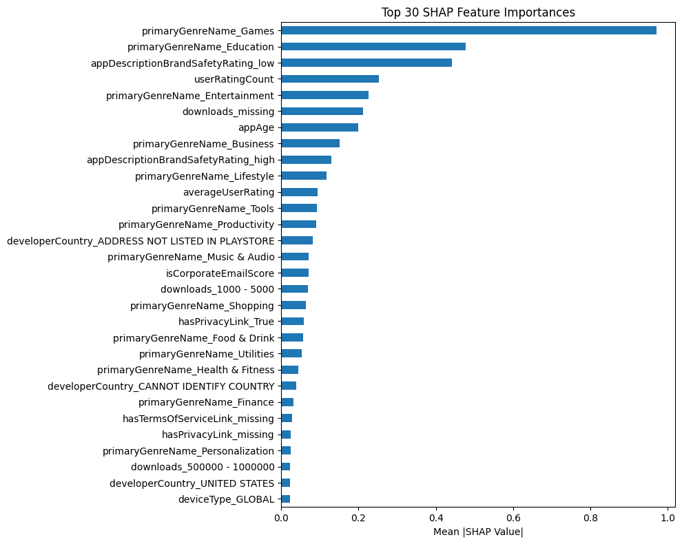

# 📊 COPPA Risk Prediction Pipeline

This project builds a machine learning pipeline to predict the **probability of COPPA violations** in mobile applications based on app metadata. It includes comprehensive **EDA**, **feature engineering**, **missing value handling**, and **ensemble model training** with calibrated probability output.

---

## 📁 Project Overview

The goal of this project is to estimate the **risk of violating children's online privacy laws** using real-world app features such as downloads, genres, ratings, and developer location. The final output is a **calibrated probability score** per app.

---

## 🔍 Project Workflow

1. **Data Loading**
   - Raw data loaded from `dataset/` directory
   - Includes `train.csv`, `test.csv`, and `target.csv`

2. **Exploratory Data Analysis (EDA)**
   - Basic stats, missing values, categorical distributions
   - Visualizations for `countryCode`, `genre`, `ratings`, etc.

3. **Data Cleaning & Imputation**
   - Drop columns with >80% missing values
   - Impute remaining missing values using appropriate strategies
   - Save cleaned dataset to CSV

4. **Feature Engineering**
   - One-hot encoding of categorical variables
   - Feature selection using SHAP values

5. **Modeling**
   - Trained using LightGBM
   - Combined two models:
     - Top-30 SHAP features (with hyperparameter tuning)
     - Top-50 SHAP features (base model)
   - Final prediction is an **ensemble average**

6. **Evaluation**
   - AUC Score
   - Probability Calibration
   - SHAP Visualizations

---

## ⚙️ Technologies Used

- Python, pandas, numpy, seaborn, matplotlib
- LightGBM
- SHAP for interpretability
- Scikit-learn for preprocessing and model calibration
- statsmodels & scipy for statistical analysis

---

## 🛠️ How to Run

```bash
git clone https://github.com/NervicsLabs/coppaRisk-classificationModel.git
cd coppaRisk-classificationModel
pip install -r requirements.txt
```

Run the Jupyter notebook:

```bash
jupyter notebook Main.ipynb
```

---

## 📈 Sample Output

- SHAP Feature Importance plot
- Ensemble AUC Score (expected: ~0.89+)
- Calibrated probability score per app

---

## 🧠 Interpretation Tools

SHAP values are used to explain feature influence on predictions:



---

## 👤 Author

- 🌐 GitHub: [@eycoo](https://github.com/eycoo)
- 🌐 GitHub: [@luminolous](https://github.com/luminolous)
- 🌐 GitHub: [@Paibull](https://github.com/Paibull)

---

## ⭐️ If you find this useful, please star the repo!